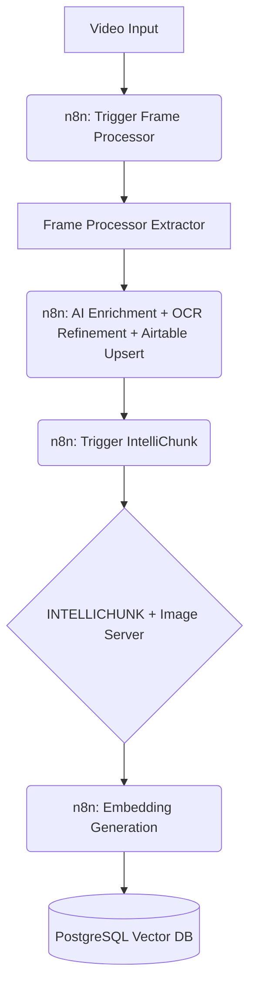

# IntelliChunk

**Smart Semantic Processing for RAG Systems**

Adaptive content processor that intelligently chunks diverse data sources based on semantic meaning. Currently optimized for processing richly annotated screen recording frame data generated by complex n8n workflows, IntelliChunk is being expanded to handle articles, structured documents, social media content, and more. It seamlessly integrates with n8n, Airtable, and image servers to prepare optimized content for retrieval and AI-powered generation.

## Workflow Context

IntelliChunk is a key component in a larger content ingestion pipeline designed for RAG systems. The general flow, orchestrated heavily by n8n workflows at each stage, looks like this:



**Detailed Steps:**

1.  **Frame Extraction:** An n8n workflow triggers the [Frame Processor](https://github.com/jaywalked78/FrameProcessor) to extract key frames from videos based on scene changes.
2.  **Enrichment & OCR:** n8n orchestrates a complex workflow for each frame:
    *   AI generates rich metadata (summaries, contextual understanding based on previous frames).
    *   OCR extracts raw text.
    *   AI refines OCR text using frame summaries for context.
    *   Sensitive data identification and handling occurs.
    *   All enriched data (metadata, refined OCR, sensitive data flags) is upserted to Airtable.
3.  **Chunking (IntelliChunk - This Repo):** An n8n workflow sends the processed, enriched JSON data (from Airtable or directly) to IntelliChunk.
4.  **Embedding & Storage:** Downstream processes (typically within n8n) handle embedding generation and storage into a vector database (e.g., PostgreSQL with pgvector).

## System Architecture

IntelliChunk focuses on semantic chunking and integration within this pipeline:

### 1. Semantic Chunker (This Repository)

A specialized text processing system that:
- Takes richly annotated input text (currently optimized for frame metadata JSON from n8n/Airtable)
- Divides text into semantic chunks for optimal retrieval
- Organizes chunks with proper metadata and references
- Prepares data for embedding generation
- Sends structured data via webhooks to other systems (e.g., back to n8n for embedding)

### 2. Integration with Image Server (This Repository)

Seamlessly works with [Lightweight File Hosting Server](https://github.com/jaywalked78/Lightweight-File-Hosting-Server) to:
- Host visual content (like screen frames) via HTTP endpoints
- Generate accessible URLs for content
- Provide a consistent interface for media retrieval
- Enable visual reference alongside text content

### 3. OCR Processing Integration (External)

IntelliChunk receives *already processed and refined* OCR data as part of its input JSON. The actual OCR and AI refinement happens in the upstream n8n workflow, potentially using external tools like [**Placeholder for OCR Repo Link - e.g., ScreenScraperOCR**].

## Overview

IntelliChunk processes the enriched data received from n8n/Airtable to:
1. Receive input JSON (currently focused on frame metadata)
2. Adaptively chunk the refined text based on semantic meaning
3. Generate image URLs for associated visual content (if applicable using the integrated Image Server)
4. Combine text chunks and image URLs into a unified dataset
5. Send processed, chunked data via webhooks (e.g., back to n8n for embedding/storage)

*Future versions will accept and process various raw text formats directly.*

## Components

### 1. Text Chunker

The text chunker processes the input JSON data:
- Extracts meaningful text (refined OCR, summaries) from the input structure
- Intelligently chunks text based on content type (expanding capabilities)
- Organizes chunks with incoming metadata
- Sends processed data via webhook

### 2. Image Server Integration

Integrated with [Lightweight File Hosting Server](https://github.com/jaywalked78/Lightweight-File-Hosting-Server) to:
- Host image content via HTTP
- Generate accessible URLs for each image
- Combine image URLs with text data

## Installation

1. Clone the repository:
   ```bash
   git clone https://github.com/jaywalked78/IntelliChunk.git
   cd IntelliChunk
   ```

2. Create a virtual environment:
   ```bash
   python3 -m venv venv
   source venv/bin/activate
   ```

3. Install dependencies:
   ```bash
   pip install -r requirements.txt
   ```

4. Configure environment:
   ```bash
   cp .env.example .env
   # Edit .env with your PRODUCTION_WEBHOOK_URL and TEST_WEBHOOK_URL
   ```

5. Setup Image Server (optional but recommended):
   ```bash
   git clone https://github.com/jaywalked78/Lightweight-File-Hosting-Server.git ../Lightweight-File-Hosting-Server
   ```

## Usage

### Basic Usage

Process a folder of screen recording frame metadata JSON files:

```bash
./run_processor_with_image_server.sh folder_name [test]
```

Arguments:
- `folder_name`: Name of the folder containing frame metadata JSON files.
- `test` (optional): If present, sends processed data to the `TEST_WEBHOOK_URL` specified in `.env`. If omitted, sends to `PRODUCTION_WEBHOOK_URL`.

*Support for other content types coming soon.*

### Advanced Usage

Process a specific JSON file containing frame metadata:

```bash
./run_processor_with_image_server.sh folder_name path/to/file.json [test]
```
*(The `test` argument behaves the same as in Basic Usage)*

### n8n Integration

For automated workflows with n8n, see [n8n_integration.md](./n8n_integration.md).

## Input/Output

### Input (Current)

- JSON files originating from an n8n/Airtable workflow, containing richly annotated screen recording frame data. This includes:
    - AI-generated summaries and context
    - AI-refined OCR text
    - Metadata (timestamps, source info, sensitive data flags, etc.)

### Input (Planned)

- Direct processing of raw text documents (articles, posts, etc.)
- Structured data feeds
- Social media content

### Output

1. **Text Processing Output**:
   - Chunked text data optimized for RAG systems
   - Webhook payload sent to either `TEST_WEBHOOK_URL` or `PRODUCTION_WEBHOOK_URL` containing structured content and metadata.

2. **Image Server Output** (when applicable):
   - JSON file with image URLs created by the integrated Image Server.
   - Format: `folder_name_YYYYMMDD_HHMMSS.json` (timestamped)
   - Symlink: `folder_name_latest.json` for easy access

## Configuration

Edit `.env` file to configure:
- `PRODUCTION_WEBHOOK_URL`: The primary webhook endpoint (e.g., n8n workflow for embedding/storage).
- `TEST_WEBHOOK_URL`: The webhook endpoint for testing purposes.
- `FRAME_BASE_DIR`: Base directory where source images might be located (used by Image Server integration).
- `CHUNK_SIZE`, `CHUNK_OVERLAP`: Parameters for the semantic chunking process.
- Other API and processing settings.

## Scripts

- `run_processor_with_image_server.sh`: Main script for triggering processing (currently frame-focused)
- `process_json_files_v5.py`: Core logic for text processing and chunking
- `main.py`: API server potentially used by n8n for receiving processing requests

## Contributing

1. Fork the repository
2. Create your feature branch: `git checkout -b feature/amazing-feature`
3. Commit your changes: `git commit -m 'Add some amazing feature'`
4. Push to the branch: `git push origin feature/amazing-feature`
5. Open a pull request

## License

This project is proprietary and not licensed for public use without explicit permission from the repository owner.

## Changelog

See [CHANGELOG.md](./CHANGELOG.md) for version history and updates. 